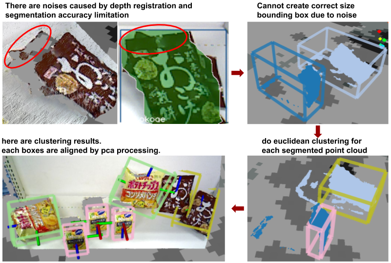
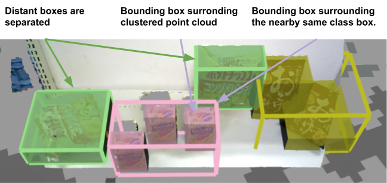

# neatness_estimator

ros package for object detection.

## instlation
```
rosdep install -y -r --from-paths --ignore-src .
catkin build neatness_estimator
```

## mask_rcnn instance segmentation and pcl proccessing
 - input
 1. `~input_image` (sensor_msgs/Image)
 2. `~input_cloud` (sensor_msgs/PointCloud2)

 - output
 There are only outputs often used on below lists
 1. `/labeled_bounding_box_publisher/labeled_instance_boxes` (jsk_recognition_msgs/BoundingBoxArray)
 2. `/labeled_bounding_box_publisher_aligned/labeled_instance_boxes` (jsk_recognition_msgs/BoundingBoxArray)
 3. `/labeled_bounding_box_publisher_aligned/labeled_cluster_boxes` (jsk_recognition_msgs/BoundingBoxArray)

### launch command
```
roslaunch neatness_estimator mask_rcnn_clustering2.launch
```

## use only multi_euclidean_clustering
 - input
 1. `~input_cluster_indices` (jsk_recognition_msgs/ClusterPointIndices)
 2. `~input_point_cloud` (sensor_msgs/PointCloud2)

 - output
 1. `~output_indices` (jsk_recognition_msgs/ClusterPointIndices)

### launch command
```
roslaunch neatness_estimator multi_euclidean_clustering.launch
```



Each boxes results are published as `/labeled_bounding_box_publisher/labeled_instance_boxes` .

## Output bounding boxes
1. same class surrounding bounding boxes
   - `/labeled_bounding_box_publisher_aligned/labeled_cluster_boxes`
2. each class bounding boxes aligned by frame
   - `/labeled_bounding_box_publisher/labeled_cluster_boxes`


